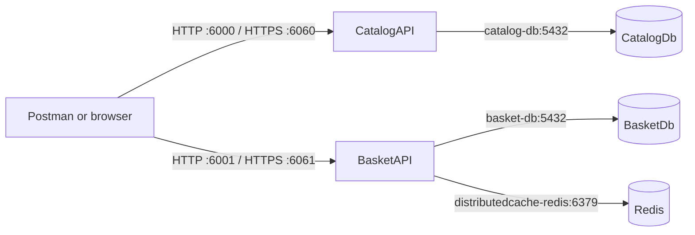

# Docker Compose Guideline

This guide explains how to run all services in `compose.yaml` and how to troubleshoot the problems encountered during setup.

## 1. Services and ports

| Service | Purpose | Host address |
| --- | --- | --- |
| `catalog-db` | PostgreSQL database for CatalogAPI | `localhost:5432` |
| `basket-db` | PostgreSQL database for BasketAPI | `localhost:5433` |
| `distributedcache-redis` | Redis distributed cache | `localhost:6379` |
| `catalog-api` | Catalog HTTP/HTTPS API | `http://localhost:6000`, `https://localhost:6060` |
| `basket-api` | Basket HTTP/HTTPS API | `http://localhost:6001`, `https://localhost:6061` |

Inside the Compose network, containers must use service names and container ports, not `localhost`:

```text
CatalogAPI  -> catalog-db:5432
BasketAPI   -> basket-db:5432
BasketAPI   -> distributedcache-redis:6379
```

## 2. Service chart



## 3. Start the complete application

Run these commands from the directory containing `compose.yaml`:

```bash
cd /Users/shrestha/RiderProjects/LearningMicroservice/E-commerce/src

# Validate the Compose file
docker compose config --quiet

# Build API images and start every service
docker compose up -d --build
```

Check the containers:

```bash
docker compose ps
```

View logs for one service:

```bash
docker compose logs -f basket-api
docker compose logs -f catalog-api
```

Stop the services without deleting database data:

```bash
docker compose down
```

To stop the services and delete the database volumes, only use this when the local data can be discarded:

```bash
docker compose down -v
```

## 4. Health checks and API testing

BasketAPI health check:

```bash
curl -k https://localhost:6061/health
```

CatalogAPI health check:

```bash
curl -k https://localhost:6060/health
```

For Postman, use the HTTPS URLs and disable certificate verification for the local self-signed development certificate:

```text
https://localhost:6061
https://localhost:6060
```

HTTP is also available:

```text
http://localhost:6001
http://localhost:6000
```

## 5. HTTPS certificate setup

The APIs listen on container ports `8080` (HTTP) and `8081` (HTTPS). Compose maps those ports to the host:

```text
CatalogAPI: 6000 -> 8080 and 6060 -> 8081
BasketAPI:  6001 -> 8080 and 6061 -> 8081
```

The Compose file mounts the host directory `${HOME}/.aspnet/https` into the containers. On macOS, `${HOME}` is the correct base directory, for example `/Users/shrestha`.

`${APPDATA}` is normally used on Windows. It is not the normal certificate directory on macOS.

Create the local certificate if it does not exist:

```bash
mkdir -p "$HOME/.aspnet/https"

dotnet dev-certs https \
  -ep "$HOME/.aspnet/https/ecommerce-dev.pfx" \
  -p basket-dev-password
```

The Compose file points both APIs to:

```text
/home/app/.aspnet/https/ecommerce-dev.pfx
```

If the certificate is missing, the API fails during startup with:

```text
Unable to configure HTTPS endpoint.
No server certificate was specified
```

Docker may still show the container as restarting because `restart: always` repeatedly starts the failed process. In that case, `ECONNRESET` is expected from Postman because no API process is listening.

## 6. Problems encountered and solutions

### Basket database container repeatedly restarted

The BasketDB volume contained PostgreSQL data created by an older PostgreSQL image, while Compose used `postgres:18`. PostgreSQL 18 rejected the old data directory format.

For disposable local data, recreate only the BasketDB volume:

```bash
docker compose down
docker volume rm src_postgres_basket
docker compose up -d basket-db
```

For important data, keep the volume and perform a PostgreSQL upgrade with `pg_upgrade`, or use the original PostgreSQL image version.

### Database name did not exist

Compose creates:

```yaml
POSTGRES_DB: BasketDb
```

The API connection string must therefore use:

```text
Database=BasketDb
```

Names such as `BasketDd` or `BaskeyDd` refer to different databases and cause:

```text
database "BasketDd" does not exist
```

When the API runs inside Compose, use `Host=basket-db;Port=5432`. The host-mapped port `5433` is for applications running on the host machine.

### Store basket returned a null username

The endpoint originally mapped the result before awaiting MediatR:

```csharp
var result = sender.Send(command);
var response = result.Adapt<StoreBasketResponse>();
```

`sender.Send` returns `Task<StoreBasketResult>`. Mapping the incomplete `Task` produced a response with a null `UserName`.

The correct code is:

```csharp
var result = await sender.Send(command);
var response = result.Adapt<StoreBasketResponse>();
```

### `ECONNRESET` from Postman

The HTTPS port was published, but ASP.NET could not start because no certificate was mounted or configured. Publishing a Docker port does not guarantee that the application is listening on that port.

The solution was to:

1. Generate `ecommerce-dev.pfx` in `${HOME}/.aspnet/https`.
2. Mount that directory into both API containers.
3. Configure the certificate path and password through `ASPNETCORE_Kestrel__Certificates__Default__*`.
4. Recreate the API containers.
5. Call `https://localhost:6061` with certificate verification disabled in Postman.

### `${HOME}` versus `${APPDATA}`

`${HOME}` is used for this macOS environment and resolves to the current user's home directory. `${APPDATA}` is mainly a Windows variable. Use the path convention appropriate for the operating system running Docker Compose.

## 7. Useful troubleshooting commands

```bash
# Show all services and published ports
docker compose ps

# Show recent logs
docker compose logs --tail=100 basket-api
docker compose logs --tail=100 catalog-api

# Check databases inside BasketDB
docker exec basketdb psql -U postgres -lqt

# Check the published endpoints
curl -i http://localhost:6001/health
curl -k -i https://localhost:6061/health
curl -i http://localhost:6000/health
curl -k -i https://localhost:6060/health
```

